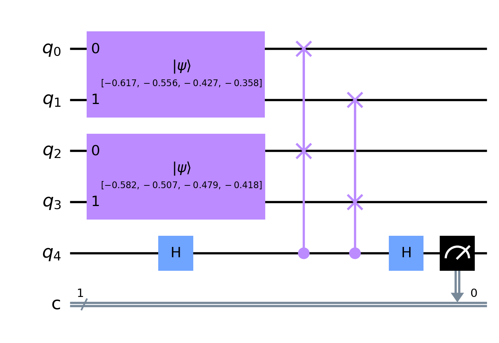
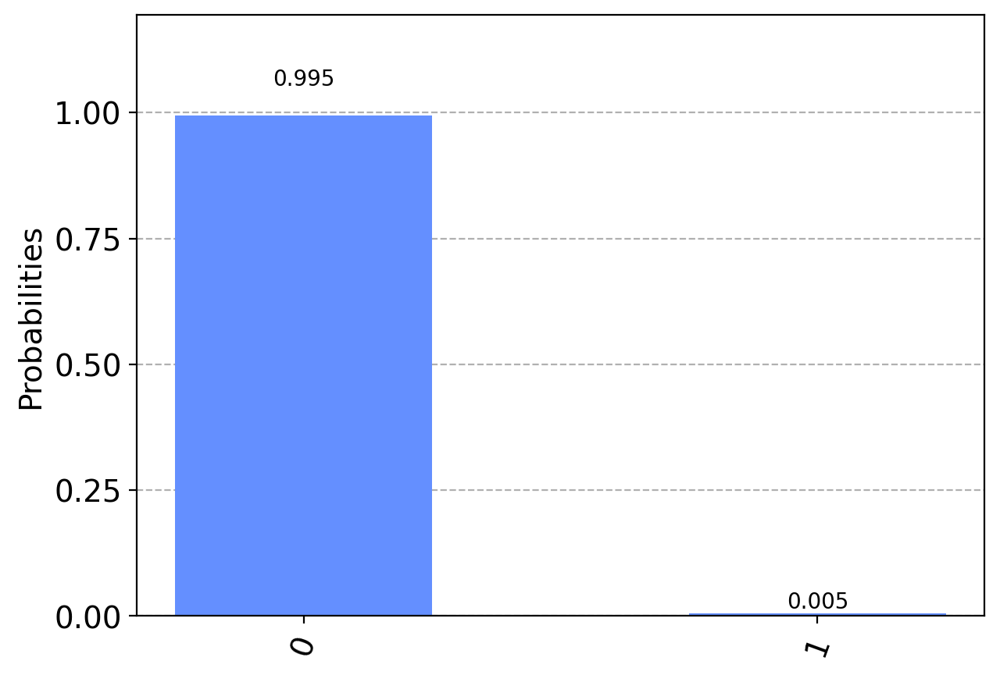

# Demo for CS 297 Report

CS 297 : Introduction to Quantum Algorithms Final Report

Demonstration for my report, <i> "Quantum Fingerprint Matching Protocol and its Application to Indoor Localization" </i>

Sample Circuit:

Sample Measurement:

